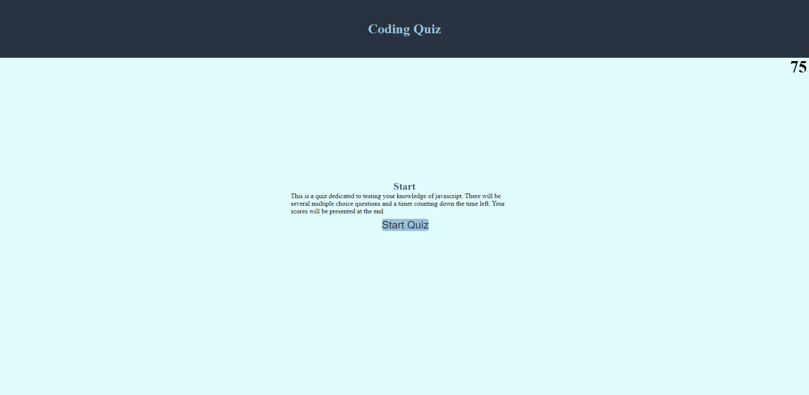

# coding-quiz-game

## Project Description

In this project we were tasked with creating a quiz application from HTML, CSS, and javaScript. When pressing the start button the quiz begins and a question is given. The timer is then displayed this is done by creating a timer function in javascript that triggers when the game screen is displayed. The second task was to display another question when the previous question was answered. This is done by creating a for loop that loops through an array of possible answers and questions and indexing through all of them. We were then to subtract from the time if an answer was written incorrectly. This was done by creating an if statement compairing the chosen answer to the correct answer and subtracting from the remaining time accordingly. The next thing to do was to make the game end when all questions were answered or when the time runs out. This was done by creating another for loop and making sure that they were directed to the end screen when either of those two happened. The only thing I struggled with was getting the scores to save to local storage. I couldn't get the scores to save with initials. There was an error with trying to get that specific part of javascript to work. I will try to fix and resubmit.

## Project Link
The project site can be found [here](https://choyle-01.github.io/coding-quiz-game/)

## Github Repository
The Github repository can be found [here](https://github.com/choyle-01/coding-quiz-game)

## Visuals
